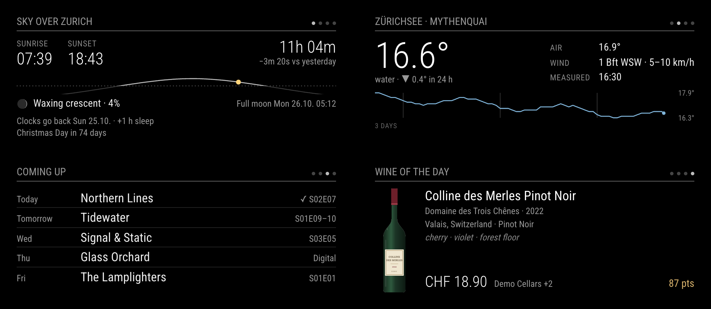

# MMM-Glance

A calm **MagicMirror² card deck for Zurich**. One small card at a time, changing every
30 seconds with a short fade: today's sun and moon, the Zürichsee water temperature, what's
coming up in Sonarr and Radarr, and (if you run the matching backend) a wine of the day.
Cards without fresh data are skipped. Rotation and fetching pause during quiet hours.



*The demo shows all four cards side by side. On the mirror you see one card at a time; the
dots in the header show where you are in the deck. All data in the screenshots is synthetic.*

- **Sky**: sunrise, sunset, day length and its change since yesterday, a sun arc with the
  sun's current position, moon phase and illumination, next full or new moon, the next
  clock change (when it's within 3 weeks) and the next public holiday in the canton of Zurich.
  Computed locally; no network access.
- **Lake**: Zürichsee water temperature with its 24 h trend, air temperature, wind and a
  3-day sparkline, from the Wasserschutzpolizei Zürich stations at Mythenquai or Tiefenbrunnen.
- **Coming up**: the next week's Sonarr episodes and Radarr home releases for the next 3 weeks,
  grouped by day. Double episodes collapse to `S01E09–10`; ✓ means already downloaded.
- **Wine of the day** (optional, off by default): needs a *grapy* server. See
  [below](#wine-of-the-day-needs-a-grapy-server) before you get your hopes up.
- API keys stay out of `config.js` (see [Secrets](#secrets)).
- No runtime npm dependencies, no build step. The runtime code avoids newer syntax, so it
  also runs on older installs (Node 10, Electron 16), which is what the author's Raspberry Pi runs.

**This module is Zurich-specific on purpose.** Holidays follow the canton of Zurich, the lake
card only knows the two Zürichsee stations, and all dates and times are in `Europe/Zurich`.
The sun and moon follow whatever `location` you configure, but outside Switzerland the rest
of the Sky card will be wrong for you.

## Install

```sh
cd ~/MagicMirror/modules
git clone https://github.com/mkubicek/MMM-Glance
```

**No `npm install` is needed.** Restart MagicMirror. To update: `git pull` in the module folder.

## Configuration

A minimal entry shows the Sky and Lake cards for Zurich city centre:

```js
{
  module: "MMM-Glance",
  position: "top_left"
}
```

A fuller one:

```js
{
  module: "MMM-Glance",
  position: "top_left",
  config: {
    location: { latitude: 47.3769, longitude: 8.5417, label: "Zurich" }, // title: "Sky over Zurich"
    lake: { station: "tiefenbrunnen" },                                   // title: "Zürichsee · Tiefenbrunnen"
    cards: ["sky", "lake", "upcoming"],
    quietHours: { from: "23:30", to: "06:00" }
    // Sonarr / Radarr: put them in ~/.config/MMM-Glance/secrets.json, not here.
  }
}
```

| Option | Default | Meaning |
| --- | --- | --- |
| `location` | `{ latitude: 47.3769, longitude: 8.5417, label: "Zurich" }` | Where sun times, day length and the sun arc are computed. `label` feeds the Sky card title. |
| `skyTitle` | `null` | Sky card title. `null` means `"Sky over <label>"`, or just `"Sky"` if `location` has no `label`. |
| `cards` | `["sky", "lake", "upcoming", "wine"]` | Which cards to rotate, in order. Cards without data are skipped, so `upcoming` and `wine` stay hidden until configured. |
| `rotateInterval` | `30000` | Milliseconds per card. |
| `fadeSpeed` | `400` | Cross-fade duration in milliseconds. |
| `width` | `460` | Card width in pixels. Height is fixed (about 180 px) so the column never jumps. |
| `quietHours` | `null` | Europe/Zurich local time window with no rotation and no fetching, for mirrors whose screen is off at night, e.g. `{ from: "23:00", to: "06:00" }`. `null` keeps it running. |
| `lake` | `{ station: "mythenquai", title: "Zürichsee · Mythenquai" }` | `station` is `"mythenquai"` or `"tiefenbrunnen"`. Without `title`, the station name is used. |
| `upcomingEntries` | `5` | Maximum rows on the Coming up card. |
| `sonarr` | `null` | `{ url, apiKey }`. Prefer the secrets file. |
| `radarr` | `null` | `{ url, apiKey }`. Prefer the secrets file. |
| `grapy` | `null` | `{ url, priceMax: 25, ratingMin: 80, minConfidence: 80 }`. Only useful with a grapy server. |

MagicMirror merges `config` over the defaults one level deep. If you set `location` or `lake`,
give the whole object (for example include `label` if you want "Sky over …").

## Secrets

MagicMirror serves `config.js` to **every browser that opens the mirror's web page**, including
any device on your LAN. API keys in `config` are therefore readable by anyone on your network.

Get each API key from your own Sonarr/Radarr web interface under **Settings → General → Security → API Key**. Enable advanced settings if needed. Copy the existing key; regenerating it can break other integrations. See [Radarr's settings guide](https://wiki.servarr.com/radarr/settings#security) and [Sonarr's settings guide](https://wiki.servarr.com/sonarr/settings). The sky/lake cards need no key.

MMM-Glance's node_helper reads keys from a file on the mirror instead, and never sends them to
the browser:

```sh
mkdir -p ~/.config/MMM-Glance
nano ~/.config/MMM-Glance/secrets.json
chmod 600 ~/.config/MMM-Glance/secrets.json
```

```json
{
  "sonarr": { "url": "http://sonarr.local:8989", "apiKey": "your-sonarr-api-key" },
  "radarr": { "url": "http://radarr.local:7878", "apiKey": "your-radarr-api-key" }
}
```

`~` is the home directory of the user that runs MagicMirror. The file may also hold a `grapy`
object. Values in `config` take precedence over the file. The file is read whenever the mirror's
page (re)connects, so a browser reload picks up changes.

## How it works

### Sky

Everything is computed in `glance.js`, locally, on every card change. No API, no network.

- **Sun**: NOAA solar-position equations; sunrise and sunset are the moments the sun's upper
  limb crosses the standard −0.833° horizon. The tests check them against
  [PyEphem](https://rhodesmill.org/pyephem/) for Zurich at the solstices and in autumn: within a
  minute.
- **Moon**: new and full moons from the main terms of Meeus, *Astronomical Algorithms*, ch. 49,
  checked against PyEphem to within 5 minutes. The phase shown between them is interpolated.
- **Clock change**: the EU rule (last Sunday of March and October, 01:00 UTC), which Switzerland
  follows. Shown when it is less than 3 weeks away.
- **Holidays**: the public holidays of the **canton of Zurich**: New Year's Day, Berchtold's Day,
  Good Friday, Easter Monday, Labour Day, Ascension Day, Whit Monday, Swiss National Day,
  Christmas Day and St Stephen's Day. Other cantons differ; this list is not configurable.

### Lake

Every 10 minutes the helper asks [tecdottir](https://github.com/metaodi/tecdottir) (a small
open-source API by Stefan Oderbolz, hosted at `tecdottir.metaodi.ch`) for the last 3 days of
readings from one of the two weather stations the City of Zurich runs for the
Wasserschutzpolizei (lake police): **Mythenquai** or **Tiefenbrunnen**. The underlying
measurements are published by the City of Zurich as
["Messwerte der Wetterstationen der Wasserschutzpolizei Zürich"](https://data.stadt-zuerich.ch/dataset/sid_wapo_wetterstationen)
on Open Data Zürich under CC0. tecdottir is a volunteer-run service with no availability
guarantee; the card disappears when the latest reading is more than 6 hours old. There are no
other lakes or stations.

### Coming up

Hourly, the helper reads the Sonarr and Radarr v3 `/api/v3/calendar` endpoints (Sonarr: the next
8 days; Radarr: the next 22 days), keeps monitored items, and dates each movie by its digital or
Blu-ray release, whichever falls into the window first. Past days are dropped. Either service on
its own is fine.

### Wine of the day (needs a grapy server)

**You probably can't use this card.** It reads from *grapy*, a personal wine-price service that
is a separate project and currently not public. It is kept here because the author's mirror uses
it, and because the card may be useful to anyone who can serve the same JSON. The card stays hidden
unless `grapy` is configured.

If you want to feed it from your own service, `grapy.url` must answer two requests:

1. `GET {url}/api/explorer/wines?sort=rating&limit=100&price_max=25&rating_min=80`
   (`price_max` and `rating_min` come from `priceMax` and `ratingMin`), every 6 hours:

   ```json
   {
     "items": [
       {
         "wine_id": 1,
         "name": "Colline des Merles Pinot Noir",
         "producer": "Domaine des Trois Chênes",
         "vintage": 2022,
         "country": "Switzerland",
         "region": "Valais",
         "grapes": ["Pinot Noir"],
         "rating": "87.40",
         "rating_count": 412,
         "rating_evidence": "established",
         "match_confidence": 96,
         "sensory": [{ "label": "Cherry" }, { "label": "Violet" }, { "label": "Forest floor" }],
         "offers": [
           { "price_per_750ml": "18.90", "source_name": "Demo Cellars", "product_id": 1, "has_image": true }
         ]
       }
     ]
   }
   ```

   Only items with a `rating`, at least one offer, `rating_evidence: "established"` and
   `match_confidence` ≥ `minConfidence` are used. The server is trusted to apply the price and
   rating filters. One wine is picked per day (deterministically, never the same two days
   running); the cheapest offer is shown, in CHF.

2. `GET {url}/api/images/product/{product_id}`: a bottle photo (any image type). Optional; if it
   fails the card shows text only. The front end cuts away a white background once per wine,
   because a white rectangle glows on a mirror.

## Raspberry Pi performance

The deck redraws only when the card changes, or when a card first gets data. There is no
continuous animation: every 30 s there is one 400 ms fade. All sources share one timer in the
helper, each with its own interval and exponential back-off on errors, and the browser only
receives a message when the data it shows changed. The lake series is thinned to hourly points
before it is sent. The bottle image is cut out and decoded once per wine, not per rotation.

## Limitations

- Zurich only, as described above: canton-of-Zurich holidays, EU daylight-saving rule,
  Zürichsee stations, `Europe/Zurich` time zone for every date and time, prices in CHF.
- English labels only; no translations.
- Sun times are within about a minute and moon phases within a few minutes. There is no
  handling for polar day or night (the times would show "—").
- tecdottir, Sonarr, Radarr and grapy are polled directly by the mirror; there is no shared cache
  across several mirrors.

## Development

```sh
npm run demo   # http://localhost:3470, no install needed
npm test       # Node 22+
```

The demo runs the real `MMM-Glance.js`, `glance.js` and CSS in a minimal MagicMirror shim, with
synthetic data pushed through the same parsers the helper uses: fictional shows and movies, a
generated 3-day lake series and a drawn bottle. URL options: `?card=lake` pins one card,
`?grid` shows all four, `?at=2026-10-12T14:40:00Z` pretends it is that moment. The screenshots in
`docs/` come from `?grid` / `?card=…` with that `at`, rendered in headless Chrome at 2× scale.

The tests cover the astronomy against PyEphem references, holidays and Easter, the DST switch,
lake parsing, the Coming up merge, the wine pick, quiet hours, Node 10 syntax compatibility of the
runtime files, and the helper's secrets-file handling against a fake Sonarr on localhost.

[Changelog](CHANGELOG.md) · [MIT license](LICENSE)
